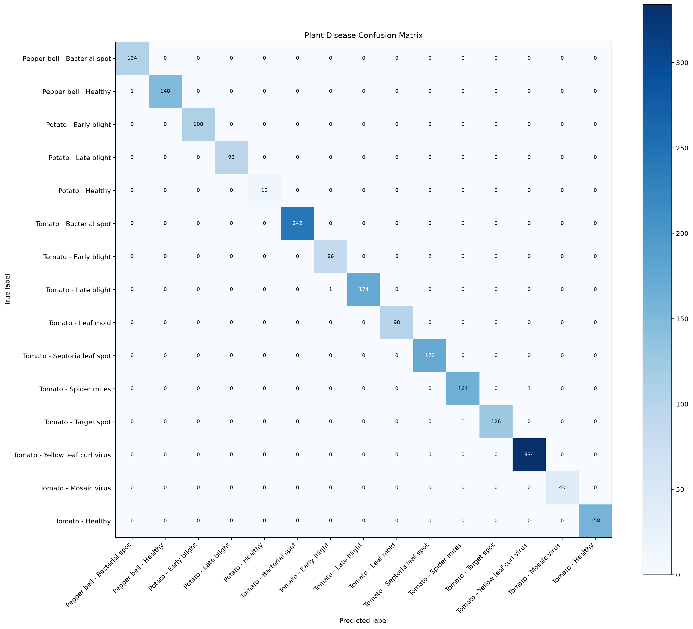
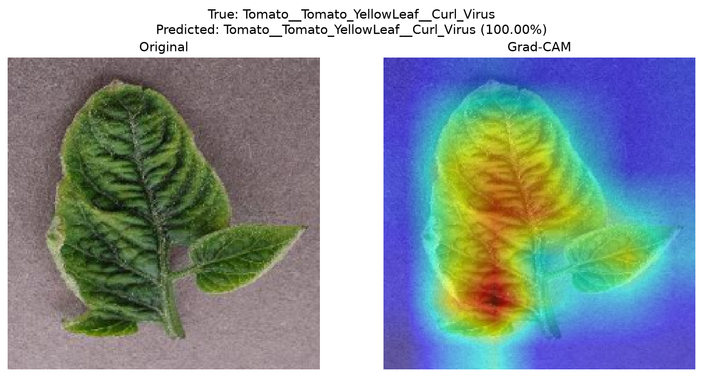

# Explainable Plant Disease Classification

An end-to-end computer vision project that classifies plant leaf images into
15 healthy and diseased categories using an ImageNet-pretrained
EfficientNet-B0 model. The project includes training, checkpointing,
single-image inference, test-set evaluation, confusion-matrix generation, and
Grad-CAM explanations.

## Overview

Plant diseases can reduce crop quality and yield when symptoms are not
identified early. This project explores automated disease recognition from
leaf images to support faster and more consistent visual screening.

A classification result alone does not explain which image regions influenced
the model. Grad-CAM is therefore used to produce heatmaps over the leaf,
helping users inspect whether predictions are based on relevant visual
patterns rather than unrelated background features.

## Features

- Multi-class classification across 15 PlantVillage categories
- EfficientNet-B0 transfer learning with ImageNet weights
- Custom dropout and linear classification head
- Reproducible train, validation, and test split using seed `42`
- Training-time augmentation and ImageNet normalization
- Best-checkpoint selection based on validation loss
- Adam optimization with weight decay
- Validation-loss learning-rate scheduling
- CPU and CUDA device support
- Top-k prediction with confidence scores for custom images
- Test accuracy, loss, precision, recall, and F1-score evaluation
- Per-class classification report
- Confusion-matrix generation
- Single-image and batch Grad-CAM visualization
- CSV manifest for generated Grad-CAM samples

## Dataset

The code loads images from `data/PlantVillage/` with
`torchvision.datasets.ImageFolder`.

| Property | Value |
|---|---:|
| Dataset | PlantVillage |
| Images recognized by `ImageFolder` | 20,638 |
| Classes | 15 |
| Training split | 16,510 images (80%) |
| Validation split | 2,063 images (10%) |
| Test split | 2,065 images (remaining 10%) |
| Split seed | 42 |
| Dataset source URL | Information not available |

### Classes

1. Pepper bell - Bacterial spot
2. Pepper bell - Healthy
3. Potato - Early blight
4. Potato - Late blight
5. Potato - Healthy
6. Tomato - Bacterial spot
7. Tomato - Early blight
8. Tomato - Late blight
9. Tomato - Leaf mold
10. Tomato - Septoria leaf spot
11. Tomato - Spider mites / Two-spotted spider mite
12. Tomato - Target spot
13. Tomato - Yellow leaf curl virus
14. Tomato - Mosaic virus
15. Tomato - Healthy

### Preprocessing

Validation, test, prediction, and Grad-CAM images use:

- Resize to `224 x 224`
- Conversion to a PyTorch tensor
- ImageNet normalization:
  - Mean: `[0.485, 0.456, 0.406]`
  - Standard deviation: `[0.229, 0.224, 0.225]`

### Data Augmentation

Training images use:

- Random resized crop to `224 x 224`
- Random horizontal flip with probability `0.5`
- Random rotation up to `15` degrees
- ImageNet normalization

## Model Architecture

The classifier is based on `torchvision.models.efficientnet_b0` initialized
with `EfficientNet_B0_Weights.DEFAULT`.

The original classifier is replaced with:

```text
Dropout(p=0.3, inplace=True)
Linear(in_features=1280, out_features=15)
```

| Property | Value |
|---|---:|
| Base architecture | EfficientNet-B0 |
| Pretraining | ImageNet |
| Input size | `224 x 224` RGB |
| Classifier input features | 1,280 |
| Output classes | 15 |
| Total parameters | 4,026,763 |
| Trainable parameters | 4,026,763 |

Although `model.py` contains a comment referring to unfreezing the final three
feature blocks, no parameters are frozen by the current implementation.
Consequently, the complete network is fine-tuned.

The codebase does not document the original rationale for choosing
EfficientNet-B0. **Information not available.**

## Training Configuration

The following values are the command-line defaults in `src/train.py`:

| Configuration | Value |
|---|---|
| Optimizer | Adam |
| Initial learning rate | `1e-3` |
| Weight decay | `1e-4` |
| Loss function | Cross-entropy loss |
| Batch size | 32 |
| Epochs | 20 |
| Scheduler | `ReduceLROnPlateau` |
| Scheduler mode | Minimize validation loss |
| Scheduler factor | `0.5` |
| Scheduler patience | 2 epochs |
| Checkpoint criterion | Lowest validation loss |
| Device | CUDA when available, otherwise CPU |

`train()` also exposes programmatic defaults of 15 epochs and a learning rate
of `1e-4`; command-line execution overrides these with the values above.

## Results

Metrics were calculated from `models/best_model.pth` on the deterministic
2,065-image test split.

| Metric | Result |
|---|---:|
| Best checkpoint epoch | 16 |
| Validation accuracy | 99.71% |
| Validation loss | 0.00856 |
| Test accuracy | 99.71% |
| Test loss | 0.01450 |
| Correct test predictions | 2,059 / 2,065 |
| Macro precision | 99.72% |
| Macro recall | 99.67% |
| Macro F1-score | 99.70% |
| Weighted precision | 99.71% |
| Weighted recall | 99.71% |
| Weighted F1-score | 99.71% |

The full per-class report is available in
[`outputs/classification_report.txt`](outputs/classification_report.txt).

### Confusion Matrix



## Explainability with Grad-CAM

Gradient-weighted Class Activation Mapping (Grad-CAM) uses gradients flowing
into a convolutional layer to estimate which spatial regions contributed most
to a selected class prediction.

This project applies Grad-CAM to the final EfficientNet feature block,
`model.features[-1]`. The resulting heatmap is overlaid on the original leaf
image so that model attention can be inspected alongside the predicted class
and confidence.

Grad-CAM is useful here because it can reveal whether the model focuses on
visible lesions, discoloration, and leaf texture instead of irrelevant
background regions. These visualizations support model debugging and improve
the transparency of individual predictions.

### Grad-CAM Example



The batch generator creates 15 distinct examples by default:

- 5 correctly classified samples
- 5 correctly classified healthy leaves
- 5 correctly classified diseased leaves

Metadata for each generated image is stored in
`outputs/gradcam/manifest.csv`.

## Project Structure

```text
explainable-plant-disease-classification/
├── app/
│   ├── app.py                         # Application placeholder
│   └── requirements.txt               # Python dependencies
├── data/
│   └── PlantVillage/                  # ImageFolder dataset with 15 classes
├── models/
│   └── best_model.pth                 # Best validation-loss checkpoint
├── outputs/
│   ├── classification_report.txt
│   ├── confusion_matrix.png
│   └── gradcam/
│       ├── manifest.csv
│       └── *_gradcam.png
├── src/
│   ├── data_loader.py                 # Splits, transforms, and data loaders
│   ├── evaluate.py                    # Metrics and confusion matrix
│   ├── generate_gradcam_examples.py   # Batch Grad-CAM generation
│   ├── gradcam.py                     # Single-image Grad-CAM example
│   ├── model.py                       # EfficientNet-B0 model definition
│   ├── predict.py                     # Custom-image inference
│   └── train.py                       # Training and checkpointing
├── .gitignore
└── README.md
```

## Installation

Python 3.10 or newer is recommended. The local project environment was created
with Python 3.12.3.

1. Clone the repository:

```bash
git clone git@github.com:TanmayK-glitch/explainable-plant-disease-classification.git
cd explainable-plant-disease-classification
```

2. Create and activate a virtual environment:

```bash
python -m venv venv
source venv/bin/activate
```

On Windows:

```powershell
venv\Scripts\activate
```

3. Install the dependencies:

```bash
python -m pip install --upgrade pip
python -m pip install -r app/requirements.txt
```

4. Place the dataset in the expected structure:

```text
data/
└── PlantVillage/
    ├── Pepper__bell___Bacterial_spot/
    ├── Pepper__bell___healthy/
    ├── Potato___Early_blight/
    └── ...
```

The dataset download procedure is **Information not available** in the
codebase.

## Training

Train with the command-line defaults:

```bash
python src/train.py
```

Customize the training configuration:

```bash
python src/train.py \
  --epochs 20 \
  --batch-size 32 \
  --learning-rate 0.001 \
  --weight-decay 0.0001 \
  --checkpoint models/best_model.pth
```

The checkpoint stores the epoch, model state, optimizer state, validation loss,
and validation accuracy.

## Evaluation

Evaluate the best checkpoint:

```bash
python src/evaluate.py
```

This command:

- Recreates the deterministic test split
- Runs inference over the full test loader
- Prints test accuracy and a per-class classification report
- Saves the confusion matrix to `outputs/confusion_matrix.png`

Specify custom paths or batch size:

```bash
python src/evaluate.py \
  --checkpoint models/best_model.pth \
  --data-dir data/PlantVillage \
  --output outputs/confusion_matrix.png \
  --batch-size 32
```

The current script prints the classification report to the terminal.
`outputs/classification_report.txt` is a generated project artifact; automatic
text-file export is not implemented in `evaluate.py`.

## Prediction

Run inference on a custom leaf image:

```bash
python src/predict.py path/to/leaf_image.jpg
```

Display more ranked predictions:

```bash
python src/predict.py path/to/leaf_image.jpg --top-k 5
```

Use a different checkpoint:

```bash
python src/predict.py path/to/leaf_image.jpg \
  --checkpoint models/best_model.pth
```

The command prints the selected device, predicted class, confidence, and top-k
class probabilities.

## Grad-CAM Visualization

Generate the default collection of 15 Grad-CAM examples:

```bash
python src/generate_gradcam_examples.py
```

Configure the number of examples per category:

```bash
python src/generate_gradcam_examples.py \
  --count 5 \
  --seed 42 \
  --checkpoint models/best_model.pth \
  --data-dir data/PlantVillage \
  --output-dir outputs/gradcam
```

The script only selects correctly predicted images and writes:

- Original and Grad-CAM comparison figures
- True class, predicted class, and confidence in each figure
- A CSV manifest containing source and output paths

`src/gradcam.py` also provides a single-image visualization, but its default
image path is machine-specific and should be changed before execution.

## Future Improvements

- Correct the parameter-freezing logic to support explicit staged fine-tuning
- Save training history and plot loss and accuracy curves
- Export the classification report directly from `evaluate.py`
- Add stratified splitting to preserve class proportions across subsets
- Add automated tests for class ordering, transforms, and checkpoint loading
- Add experiment tracking and configuration files
- Add confidence calibration and uncertainty analysis
- Validate performance on field images outside the PlantVillage distribution
- Package inference and Grad-CAM into a web or API application
- Add model export support such as ONNX or TorchScript

## Technical Skills Demonstrated

- **PyTorch:** datasets, data loaders, training loops, checkpointing, and inference
- **Transfer Learning:** ImageNet-pretrained EfficientNet-B0 initialization
- **Fine-Tuning:** end-to-end optimization of a pretrained convolutional network
- **Computer Vision:** image preprocessing, augmentation, and multi-class classification
- **Model Evaluation:** accuracy, loss, precision, recall, F1-score, and confusion matrices
- **Explainable AI (XAI):** Grad-CAM heatmaps for prediction interpretation
- **Deep Learning:** optimization, learning-rate scheduling, and GPU-aware execution
- **ML Engineering:** reusable CLI scripts, deterministic splits, artifact generation, and path handling

## Key Learnings

- Building a reproducible image-classification pipeline with `ImageFolder`
- Adapting a pretrained architecture to a custom 15-class problem
- Separating training augmentation from evaluation preprocessing
- Selecting and restoring the best validation-loss checkpoint
- Evaluating both aggregate and per-class model performance
- Mapping output indices consistently to dataset class names
- Using Grad-CAM to inspect spatial evidence behind model predictions
- Designing command-line workflows for training, evaluation, inference, and explainability
